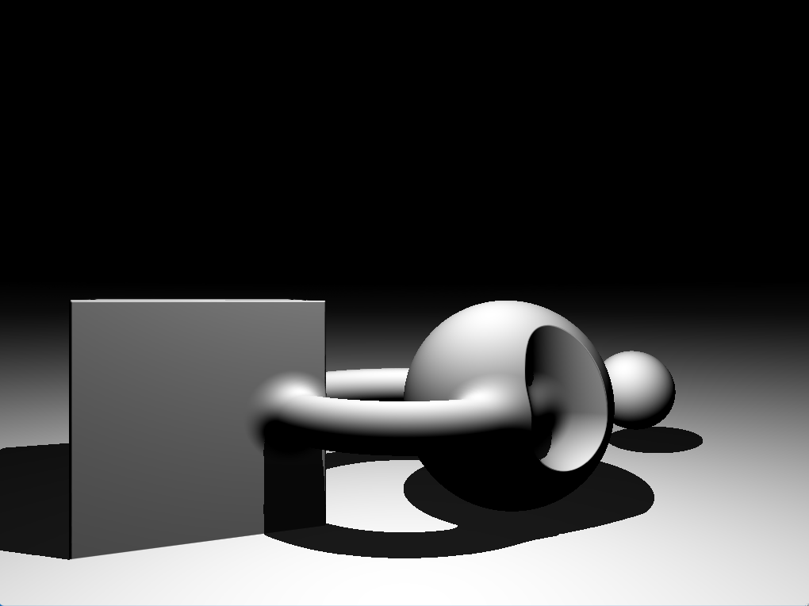

# basic-ray-marcher
A simple ray marching program written in GLSL, this project implemented and demonstrates some of the basic operations and capabilities of raymarching:
* Union
* Intersection
* Boolean subtraction
* Shadows

 